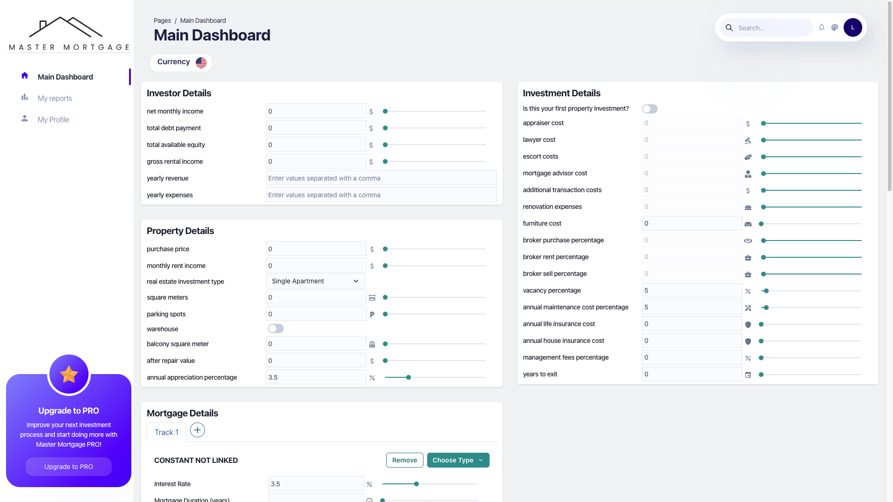

# Mortgage Master

Mortgage Master is a tool designed to simplify and streamline mortgage management by providing users with the ability to handle multiple mortgage tracks, calculate mortgage details, and perform advanced financial modeling. The project is built with a React front-end and a Flask back-end.

### Homepage
Where you can sign up or login to the system.

### Main Dashboard
In this page you can adjust all different aspects of your investment details. Such as details about you as an investor to get a better picture of your financial situation. Details about the property you aim to invest in. Assemble your desire mortgage loan with all different tracks. And also details related to the investment itself.

### Investment Summery
When you scroll down the dashboard page and after pressing the calculate button, you'll see all investment insights that the system has calculated for you considering all the details you have entered in the tables. You will be able to see both graphical illustrations representing some insights and some raw important values that will help you get a better understanding how this investment performs and whether thats the right investment for you.

### My Reports Page
At this page you'll be able to manage and see all the reports you saved about previous investments. You can edit those reports, add tasks, and see their status. In addition, you can download a PDF report file so you can send it to others as well.

### My Profile Page
In this page you can manage your account settings, such as your details, notifications, password change or delete the account.


## Features

- **Multiple Mortgage Tracks**: Supports multiple mortgage tracks, allowing users to manage different mortgage types and their details within a single interface.
- **Dynamic Mortgage Types**: Allows users to select from various mortgage types such as Constant Not Linked, Constant Linked, Change Linked, Change Not Linked, Eligibility, and Prime, with track-specific details.
- **Input Validation**: Includes input validation to ensure users provide valid data for each mortgage track (e.g., initial loan amount, interest-only periods, etc.).
- **Data Visualization**: Provides visual representation of financial metrics such as Yearly IRR, ROI, NOI, Cash Flow, and more using charts.
- **Advanced Financial Modeling**: Handles complex mortgage data and investment calculations using the BMM model and its associated mortgage pipelines.
- **Task Management**: Integrated task management system for users to manage related tasks with options to add, edit, delete, and mark tasks as complete.
- **Customizable Input Fields**: Renders various input types such as sliders, switches, and text inputs, adapting dynamically to the field type.

## Technology Stack

### Front-end

- **React**: Front-end framework used for building user interfaces and managing state.
- **Chakra UI**: UI component library for creating beautiful, responsive interfaces.

### Back-end

- **Flask**: Python-based micro-framework for handling server-side logic and API routes.
- **BMM (Business Mortgage Model)**: Custom business logic class for mortgage calculations, supporting various mortgage types and complex financial operations.

## Getting Started

### Prerequisites

To run this project locally, you'll need the following:

- **Node.js** (v14 or higher)
- **Python** (v3.8 or higher)
- **Flask** (for the back-end)

### Installation

1. Clone the repository:

    ```bash
    git clone https://github.com/idoziv15/mortgage-master.git
    cd mortgage-master
    ```

2. Install front-end dependencies:

    ```bash
    cd client
    npm install
    ```

3. Install back-end dependencies:

    ```bash
    cd ../server
    pip install -r requirements.txt
    ```

4. Create environment variables:

   Set up any required environment variables in `.env` files both for the front-end and back-end, especially for authentication, database configurations, etc.

### Running the Application

1. Start the Flask server (back-end):

    ```bash
    cd server
    flask run
    ```

2. Start the React app (front-end):

    ```bash
    cd client
    npm start
    ```

Your application should now be running at `http://localhost:3000` (React app) and `http://localhost:5000` (Flask API).

## Usage

### Mortgage Management:

- Add, edit, or remove mortgage tracks dynamically.
- Customize each mortgage track's mortgage type and input relevant financial data.

### Task Management:

- Manage related tasks (adding, editing, and deleting) via a dropdown menu and modal dialogs.

### Investment Calculations:

- Leverage the BMM class to calculate total debt payment, cash flow, and other investment metrics.

### Visualization:

- View and analyze financial data through charts and tables within the dashboard.

